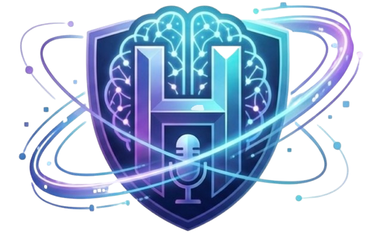

<p align="center">
  
</p>

<h1 align="center">Hireon</h1>
<p align="center"><strong>Your Unfair Interview Advantage</strong></p>

<p align="center">
  An AI-powered interview preparation platform that researches the company, builds a personalized prep pack,<br/>
  conducts a live voice mock interview, and delivers a comprehensive performance report —<br/>
  all powered by <strong>Amazon Nova</strong> foundation models on <strong>AWS Bedrock</strong>.
</p>

<p align="center">
  
</p>

<p align="center">
  
  
  
  
  
</p>

---

## 📖 Table of Contents

- [Overview](#-overview)
- [Features](#-features)
- [App Flow](#-app-flow)
- [Amazon Nova Models Used](#-amazon-nova-models-used)
- [Tech Stack](#-tech-stack)
- [Project Structure](#-project-structure)
- [Prerequisites](#-prerequisites)
- [Setup & Installation](#-setup--installation)
- [Running the App](#-running-the-app)
- [Environment Variables](#-environment-variables)
- [Architecture Deep Dive](#-architecture-deep-dive)
- [Troubleshooting](#-troubleshooting)
- [License](#-license)

---

## 🧠 Overview

**Hireon** is a full-stack, AI-native interview preparation tool. Upload your resume and a job description, and Hireon will:

1. **Research** the target company and role using AI
2. **Generate** a personalized prep pack with fit analysis, skills radar, and an interview game plan
3. **Conduct** a real-time voice mock interview using Amazon Nova 2 Sonic (speech-to-speech)
4. **Analyze** your performance using multimodal AI (webcam snapshots + transcript)
5. **Deliver** a detailed report with scores, strong/weak moments, body language insights, and a crash plan

No copy-pasting into ChatGPT. No generic question lists. **One flow. Fully personalized. Voice-driven.**

---

## ✨ Features

| Feature | Description |
|---|---|
| 🎯 **Smart Research** | AI analyzes your resume against the JD, researches the company, and identifies strengths & gaps |
| 📊 **Prep Pack** | Skills radar chart, fit score, tailored interview plan, and company insights — all in one page |
| 🎙️ **Live Voice Interview** | Real-time speech-to-speech mock interview powered by Nova 2 Sonic with automatic turn detection |
| 📷 **Webcam Analysis** | Periodic snapshots during the interview capture body language, eye contact, and posture |
| 📝 **Live Transcript** | Real-time scrolling transcript with role labels (Interviewer / You) |
| 🧠 **Extended Thinking** | Nova 2 Lite with deep reasoning for nuanced performance analysis |
| 📈 **Performance Report** | Overall score, communication/technical/confidence metrics, radar chart, action plan |
| 🎨 **Premium Dark UI** | Polished dark theme with smooth animations via Motion (Framer Motion) |

---

## 🔄 App Flow

```
┌─────────────┐     ┌──────────────┐     ┌────────────┐     ┌──────────────────┐     ┌───────────┐     ┌────────┐
│   INPUT      │────▶│  RESEARCHING  │────▶│  PREP PACK  │────▶│  MOCK INTERVIEW   │────▶│ ANALYZING  │────▶│ REPORT  │
│ Upload Resume│     │ Nova 2 Lite   │     │ Review Plan │     │ Nova 2 Sonic      │     │ Nova 2 Lite│     │ Scores  │
│ + Job Desc   │     │ + Reasoning   │     │ + Fit Map   │     │ Speech-to-Speech  │     │ + Thinking │     │ + Plan  │
└─────────────┘     └──────────────┘     └────────────┘     └──────────────────┘     └───────────┘     └────────┘
```

---

## 🤖 Amazon Nova Models Used

| Stage | Model | Model ID | Capability |
|---|---|---|---|
| **Research & Prep** | Nova 2 Lite | `us.amazon.nova-2-lite-v1:0` | Fast multimodal reasoning with 1M token context — analyzes PDFs, generates structured JSON |
| **Live Mock Interview** | Nova 2 Sonic | `amazon.nova-2-sonic-v1:0` | Bidirectional speech-to-speech streaming with automatic voice activity detection (VAD) |
| **Performance Analysis** | Nova 2 Lite (Extended Thinking) | `us.amazon.nova-2-lite-v1:0` | Deep reasoning over webcam snapshots + transcript for nuanced, multi-dimensional feedback |

### Why These Models?

- **Nova 2 Lite** — Lightning-fast multimodal model that handles PDFs, images, and text with extended thinking for deep analysis. Perfect for both quick research and thorough post-interview analysis.
- **Nova 2 Sonic** — Purpose-built for real-time voice conversations. Native speech-to-speech (no STT→LLM→TTS pipeline), sub-second latency, automatic turn detection. Makes the mock interview feel like talking to a real person.

---

## 🛠️ Tech Stack

| Layer | Technology |
|---|---|
| **Framework** | React 19, TypeScript 5.8 |
| **Build Tool** | Vite 6 |
| **Styling** | Tailwind CSS 4 (Oxide engine) |
| **Animations** | Motion (Framer Motion) 12 |
| **Charts** | Recharts 3 |
| **Markdown** | react-markdown 10 |
| **AI SDK** | `@aws-sdk/client-bedrock-runtime` |
| **Voice Server** | Express + Socket.IO (WebSocket proxy to Nova 2 Sonic) |
| **HTTP/2** | `@smithy/node-http-handler` (NodeHttp2Handler for bidirectional streaming) |

---

## 📁 Project Structure

```
Hireon/
├── index.html                  # Entry HTML — loads the React app
├── package.json                # Dependencies and npm scripts
├── tsconfig.json               # TypeScript configuration
├── vite.config.ts              # Vite config — Tailwind plugin, env injection, proxy
├── .env.example                # Template for environment variables
├── .gitignore                  # Git ignore rules
├── metadata.json               # App metadata (name, permissions)
│
├── src/
│   ├── main.tsx                # React entry point
│   ├── App.tsx                 # Root component — state machine (6 screens)
│   ├── types.ts                # Shared TypeScript interfaces
│   ├── index.css               # Global styles — Tailwind imports, theme, scrollbar
│   │
│   ├── components/
│   │   ├── InputScreen.tsx     # Upload resume + JD (drag & drop, PDF/text)
│   │   ├── ResearchScreen.tsx  # AI researches company — live progress cards
│   │   ├── PrepPackScreen.tsx  # Prep pack display — fit map, skills radar, plan
│   │   ├── MockInterviewScreen.tsx  # Live voice interview — video, transcript, controls
│   │   ├── AnalyzingScreen.tsx # Post-interview analysis — step progress, deep thinking
│   │   └── ReportScreen.tsx    # Final report — scores, radar, examples, action plan
│   │
│   ├── server/
│   │   └── sonic-server.ts     # Express + Socket.IO proxy for Nova 2 Sonic
│   │
│   └── utils/
│       └── file.ts             # PDF/text file parsing utilities
│
└── .vscode/
    └── tasks.json              # VS Code tasks for dev server + Sonic server
```

---

## 📋 Prerequisites

Before you begin, make sure you have the following:

### 1. Node.js 18+

```bash
# Check your version
node --version   # Should be v18.x or higher

# Install via Homebrew (macOS)
brew install node
```

### 2. AWS Account with Bedrock Access

You need an AWS account with access to Amazon Bedrock and the following models enabled:

| Model | Region Requirement |
|---|---|
| `us.amazon.nova-2-lite-v1:0` | Any Bedrock region (recommended: `us-east-1`) |
| `amazon.nova-2-sonic-v1:0` | **Only**: `us-east-1`, `us-west-2`, `ap-northeast-1`, `eu-north-1` |

> **⚠️ Important:** You must explicitly enable model access in the [Amazon Bedrock Console](https://console.aws.amazon.com/bedrock/home#/modelaccess). Go to **Model access** → **Manage model access** → Enable **Nova 2 Lite** and **Nova 2 Sonic**.

### 3. AWS IAM Credentials

Create an IAM user (or use existing credentials) with the `AmazonBedrockFullAccess` managed policy:

```bash
# Option A: Use AWS CLI to configure (if installed)
aws configure
# Enter your Access Key ID, Secret Access Key, and region (us-east-1)

# Option B: Manually create a .env file (see below)
```

### 4. Git

```bash
git --version   # Any recent version works
```

---

## 🚀 Setup & Installation

### Step 1: Clone the Repository

```bash
git clone https://github.com/coldboxer007/Hireon.git
cd Hireon
```

### Step 2: Install Dependencies

```bash
npm install
```

This installs all required packages including React, Vite, Tailwind CSS, AWS SDK, Socket.IO, and more.

### Step 3: Configure Environment Variables

```bash
# Copy the example env file
cp .env.example .env
```

Open `.env` in your editor and fill in your AWS credentials:

```env
AWS_ACCESS_KEY_ID="AKIA..."
AWS_SECRET_ACCESS_KEY="your-secret-key"
AWS_REGION="us-east-1"
AWS_DEFAULT_REGION="us-east-1"
```

> **🔒 Security Note:** The `.env` file is git-ignored and will never be committed. Never share your AWS credentials publicly.

### Step 4: Verify TypeScript Compiles

```bash
npm run lint
```

This runs `tsc --noEmit` and should produce **zero errors**.

---

## ▶️ Running the App

Hireeon requires **two servers** running simultaneously:

### Terminal 1 — Vite Dev Server (Frontend)

```bash
npm run dev
```

This starts the Vite development server at **http://localhost:3000**.

### Terminal 2 — Sonic Server (Voice Interview Backend)

```bash
npm run sonic
```

This starts the Express + Socket.IO server at **http://localhost:3001**, which proxies WebSocket audio to/from Amazon Nova 2 Sonic.

### Open in Browser

Navigate to **http://localhost:3000** — you'll see the Hireon landing page.

> **💡 Tip:** If using VS Code, you can use the preconfigured tasks:
> - `Cmd+Shift+P` → `Tasks: Run Task` → **Dev Server**
> - `Cmd+Shift+P` → `Tasks: Run Task` → **Sonic Server**

---

## 🔐 Environment Variables

| Variable | Required | Description |
|---|---|---|
| `AWS_ACCESS_KEY_ID` | ✅ | Your AWS IAM access key |
| `AWS_SECRET_ACCESS_KEY` | ✅ | Your AWS IAM secret key |
| `AWS_REGION` | ✅ | AWS region — must be `us-east-1` for Sonic support |
| `AWS_DEFAULT_REGION` | ✅ | Fallback region (set same as `AWS_REGION`) |

### How Credentials Are Used

- **Frontend (Vite):** The frontend only receives `VITE_SONIC_SERVER_URL` at build time — AWS credentials are **never** exposed to the browser.
- **Sonic Server:** Reads credentials from `.env` via `dotenv`. The Express server uses them to establish HTTP/2 bidirectional streams with Nova 2 Sonic.
- **Frontend Bedrock calls** (research & analysis): Made directly from the browser using credentials read at runtime from the server, or via IAM role in production.

> **⚠️ Production Note:** For production deployments, use IAM roles on EC2/App Runner — no credentials in `.env` needed at all.

---

## 🏗️ Architecture Deep Dive

### State Machine

The app is driven by a simple state machine in `App.tsx`:

```
INPUT → RESEARCHING → PREP_PACK → MOCK_INTERVIEW → ANALYZING → REPORT
```

Each state renders a dedicated full-screen component. Data flows forward through props.

### Research Phase (`ResearchScreen.tsx`)

1. Parses uploaded PDF/text files
2. Sends resume + JD to **Nova 2 Lite** via the Bedrock Converse API
3. Receives structured JSON: company insights, fit map, skills analysis, interview plan
4. Displays live progress with animated step cards

### Mock Interview Phase (`MockInterviewScreen.tsx` + `sonic-server.ts`)

```
┌──────────┐    Socket.IO     ┌──────────────┐    HTTP/2 Bidi Stream    ┌──────────────┐
│  Browser  │◄──────────────▶│ Sonic Server  │◄─────────────────────────▶│ Nova 2 Sonic │
│ (React)   │  audio chunks   │ (Express)     │  InvokeModelWithBidi     │ (Bedrock)    │
│           │  + events       │ :3001         │  StreamCommand           │              │
└──────────┘                 └──────────────┘                          └──────────────┘
```

- **Browser** captures microphone audio via `MediaRecorder` (webm/opus), sends base64 chunks over Socket.IO
- **Sonic Server** maintains a persistent HTTP/2 bidirectional stream to Bedrock, forwarding audio events and receiving AI audio + transcript responses
- **Turn Detection** is handled natively by Nova 2 Sonic's VAD (Voice Activity Detection) with `endpointingSensitivity: 'MEDIUM'`
- **Gapless Playback** — the client queues audio chunks and plays them sequentially for smooth speech

### Analysis Phase (`AnalyzingScreen.tsx`)

1. Selects up to 8 evenly-spaced webcam snapshots from the interview
2. Sends images + full transcript to **Nova 2 Lite with Extended Thinking** (`reasoningConfig`)
3. AI performs deep reasoning over visual + textual data
4. Returns structured JSON: scores, metrics, examples, action plan, body language insights

### Report Phase (`ReportScreen.tsx`)

- Renders the AI-generated report with:
  - Overall readiness score (0–100)
  - Radar chart (Communication, Technical, Confidence)
  - Metric progress bars
  - Strong moments with quotes
  - Areas to improve with better alternatives
  - Tonight's crash plan (actionable study guide)
  - Behavioral/body language insights from webcam analysis

---

## 🐛 Troubleshooting

### "AccessDeniedException" or "UnrecognizedClientException"

- Verify your `AWS_ACCESS_KEY_ID` and `AWS_SECRET_ACCESS_KEY` in `.env`
- Ensure the IAM user has `AmazonBedrockFullAccess` policy attached
- Confirm you've enabled Nova 2 Lite and Nova 2 Sonic in the [Bedrock Model Access console](https://console.aws.amazon.com/bedrock/home#/modelaccess)

### Sonic Server Won't Connect

- Make sure you're using a [supported region for Nova 2 Sonic](https://docs.aws.amazon.com/bedrock/latest/userguide/models-supported.html): `us-east-1`, `us-west-2`, `ap-northeast-1`, or `eu-north-1`
- Check that port `3001` is not already in use: `lsof -i :3001`
- The Sonic server logs connection status to the terminal — check for errors there

### Video/Camera Not Working

- Allow camera and microphone permissions when the browser prompts
- Hireon requires HTTPS or `localhost` for `getUserMedia` — it won't work on plain HTTP with a non-localhost domain

### Transcript Not Scrolling / Layout Issues

- The mock interview screen uses `h-screen` with `overflow-hidden` to prevent the page from growing
- If you see layout issues, try a hard refresh (`Cmd+Shift+R`)

### Vite Dev Server Hangs on macOS

- If the terminal process gets suspended (SIGSTOP), use VS Code Tasks instead of background terminal processes
- Run via: `Cmd+Shift+P` → `Tasks: Run Task` → **Dev Server**

---

## 📄 NPM Scripts

| Script | Command | Description |
|---|---|---|
| `npm run dev` | `vite --port=3000 --host=0.0.0.0` | Start Vite dev server |
| `npm run sonic` | `tsx src/server/sonic-server.ts` | Start Sonic WebSocket proxy server |
| `npm run build` | `vite build` | Production build to `dist/` |
| `npm run preview` | `vite preview` | Preview production build locally |
| `npm run lint` | `tsc --noEmit` | TypeScript type-check (no output) |
| `npm run clean` | `rm -rf dist` | Remove build artifacts |

---

## 🏆 Hackathon Category

**Multimodal Understanding** — Hireon processes text (resumes, JDs), documents (PDFs), audio (live speech), and images (webcam snapshots) through Amazon Nova models to deliver a unified, end-to-end interview preparation experience.

---

## 📝 License

MIT

---

<p align="center">
  Built with ☕ and Amazon Nova · <strong>Hireon</strong> — Your Unfair Interview Advantage
</p>
